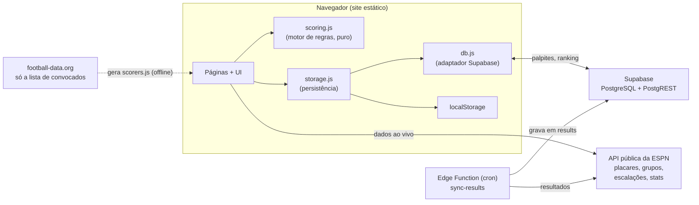
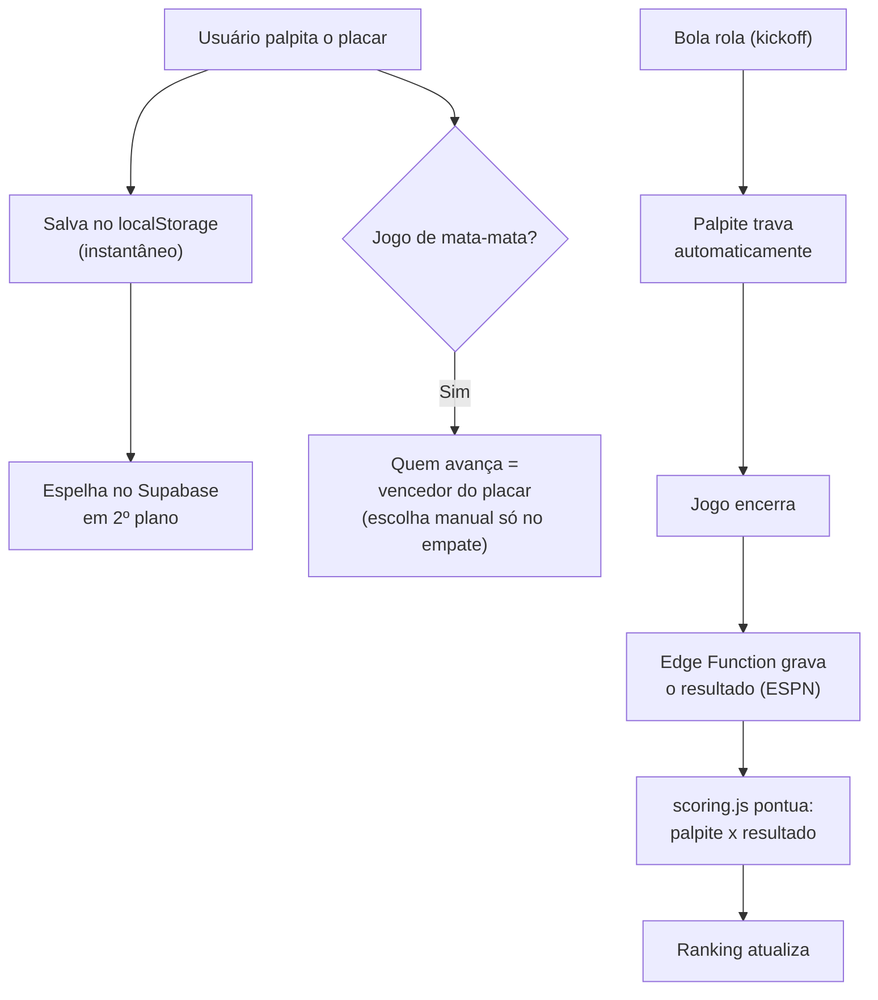
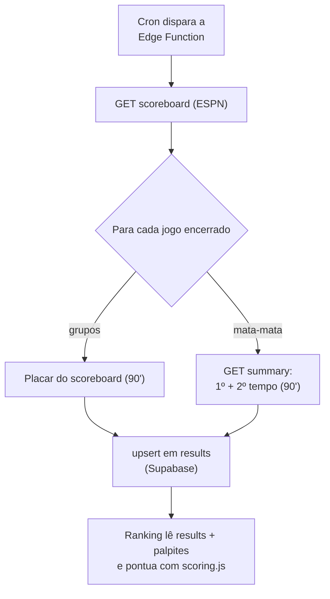

# Arquitetura — Bolão CDM (Copa 2026)

Visão de **alto nível** do sistema: como as peças se conectam, o ciclo de vida de
um palpite e as regras do bolão. Para o detalhamento técnico módulo a módulo
(funções, modelo de dados, segurança), veja [`DOCUMENTACAO.md`](DOCUMENTACAO.md).

## Em uma frase

Um site **estático** (HTML/CSS/JS puro) que guarda o palpite no navegador para
resposta instantânea, espelha tudo num **Supabase** compartilhado para o ranking,
e lê os dados reais da Copa da **API pública da ESPN** — sem framework, sem build.

## Componentes



- **Navegador** — o site roda inteiro no cliente. A UI nunca fala direto com o
  banco: passa por `storage.js` (local) e `db.js` (Supabase). A regra de negócio
  fica isolada num motor de **funções puras** (`scoring.js`), reusado no ranking,
  no dashboard e nos testes.
- **Supabase** — guarda palpites, bônus e resultados; serve o ranking compartilhado.
- **ESPN** — fonte única dos dados reais: placares, classificação, chaveamento,
  escalações e estatísticas. Lida no cliente (CORS liberado) e pela Edge Function.
- **football-data.org** — usado só offline, para gerar a lista de convocados
  (`scorers.js`) do palpite de artilheiro.

## Camadas (dependência unidirecional)

A interface depende das camadas de baixo, nunca o contrário:

```
UI por página  →  scoring.js (regras)  →  storage.js  →  db.js  →  Supabase
                                                    ↘  localStorage
```

Isso mantém a regra de pontuação testável (puro, sem efeitos colaterais) e troca o
backend sem tocar na interface.

## Ciclo de vida de um palpite



## Resultados e pontuação (automático)



No mata-mata, o placar que vale é o do **tempo regulamentar**; prorrogação e
pênaltis não contam como gol (pênaltis só decidem quem avança).

## Regras do bolão (resumo)

| Acerto | Pontos |
| --- | --- |
| Placar exato | 10 |
| Resultado certo (1/X/2) | 5 |
| Saldo de gols | +3 |
| Quem avança (mata-mata) | +2 |

- **Multiplicador por fase:** grupos 1x, 16-avos 1,25x, oitavas 1,5x, quartas 2x,
  semis e 3º lugar 2,5x, final 3x.
- **Quem avança** segue o vencedor do palpite; a escolha manual só aparece no empate.
- **Bônus:** seleção campeã 20, artilheiro 15.
- **Desempate:** mais placares exatos, depois mais resultados certos.

## As páginas e o uso

| Página | O que faz | Fonte de dados |
| --- | --- | --- |
| Início | Hero, prêmios, atalhos, resumo das regras | — |
| Jogos | Palpitar os 104 jogos + bônus | Supabase (palpites) |
| Meus palpites | Dashboard individual (pontos, detalhe por jogo) | Supabase |
| Palpites da Galera | Palpites de todos, jogo a jogo | Supabase |
| Ranking | Classificação + gráfico de evolução por participante | Supabase |
| Grupos e Chave | Classificação e chaveamento reais da Copa | ESPN |
| Estatísticas | Artilharia, assistências, cartões, público, ranking por seleção | ESPN |
| Regras | Pontuação, multiplicadores e premiação | — |

## Onde aprofundar

- [`DOCUMENTACAO.md`](DOCUMENTACAO.md) — detalhamento técnico: modelo de dados,
  módulo a módulo, motor de pontuação e segurança.
- [`README.md`](README.md) — visão geral e como rodar.
- [`docs/backend-supabase.md`](docs/backend-supabase.md) — como configurar o backend.
