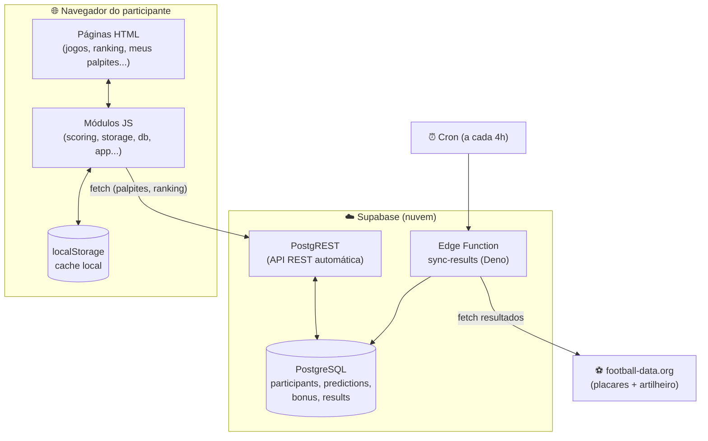
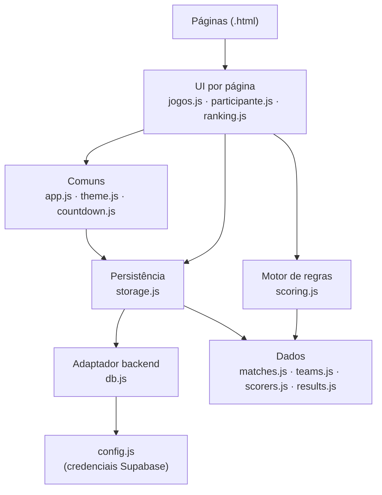
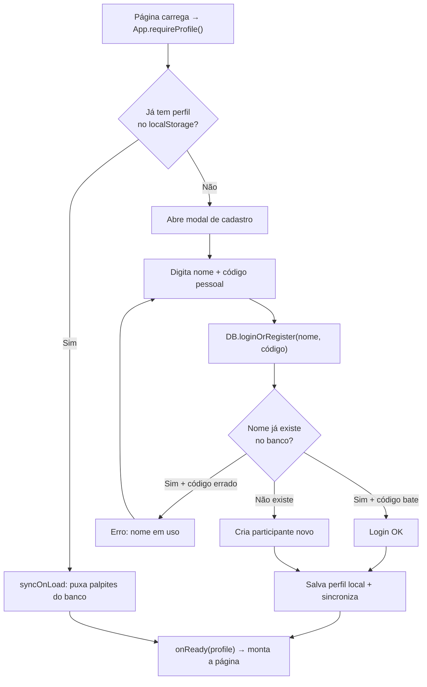
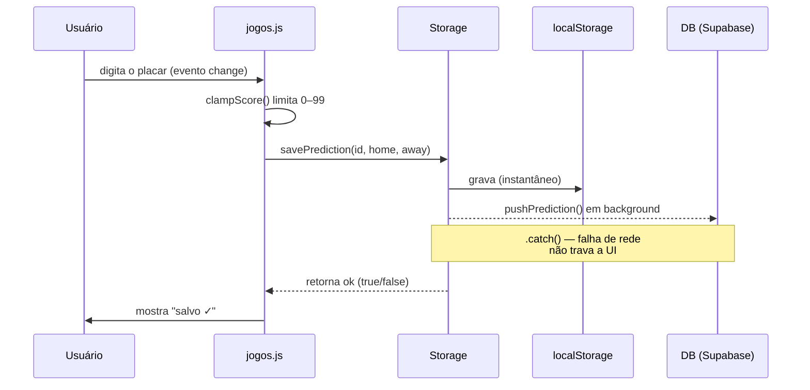
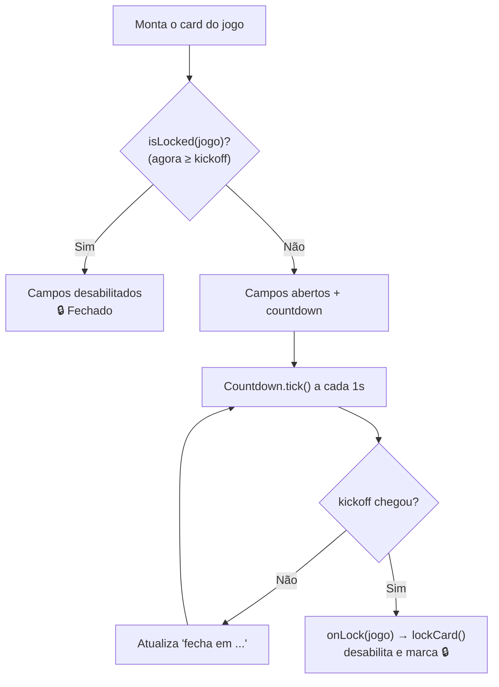
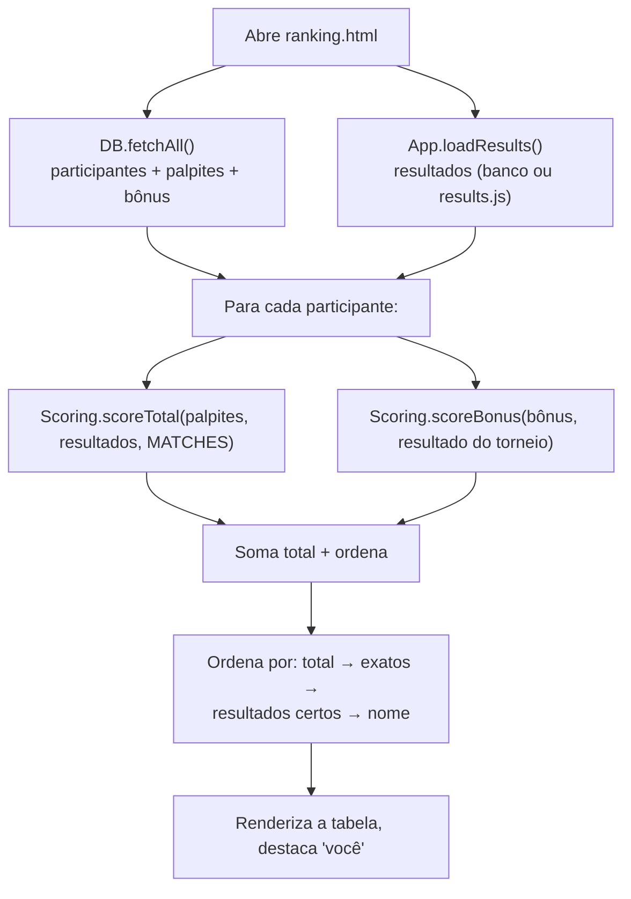
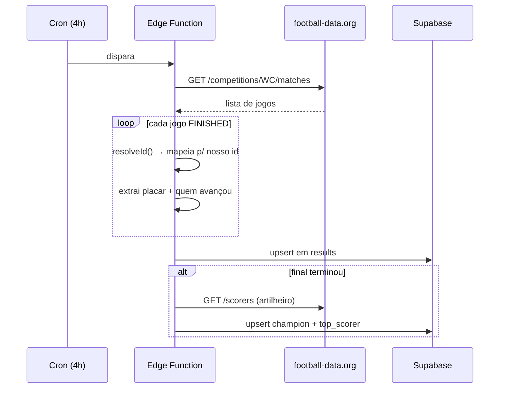

# Documentação técnica — Bolão CDM (Copa 2026)

> Documento de estudo e referência da arquitetura. Explica **como o sistema
> funciona por dentro**, com fluxogramas e detalhamento do código módulo a
> módulo. Serve tanto para eu retomar o projeto meses depois quanto para
> apresentar a lógica num portfólio.

## Índice

1. [Visão geral](#1-visão-geral)
2. [A ideia central: como tudo se conecta](#2-a-ideia-central-como-tudo-se-conecta)
3. [Arquitetura em camadas](#3-arquitetura-em-camadas)
4. [Mapa de arquivos](#4-mapa-de-arquivos)
5. [Modelo de dados](#5-modelo-de-dados)
6. [Fluxos principais (fluxogramas)](#6-fluxos-principais-fluxogramas)
7. [Detalhamento por módulo](#7-detalhamento-por-módulo)
8. [O motor de pontuação em detalhe](#8-o-motor-de-pontuação-em-detalhe)
9. [Decisões de design e trade-offs](#9-decisões-de-design-e-trade-offs)
10. [Segurança](#10-segurança)
11. [Como rodar e publicar](#11-como-rodar-e-publicar)
12. [Glossário](#12-glossário)

---

## 1. Visão geral

O **Bolão CDM** é um site de apostas amistosas (sem dinheiro real circulando
pelo sistema) entre amigos para a Copa do Mundo de 2026. Cada participante
palpita o placar dos 104 jogos, mais dois palpites bônus (seleção campeã e
artilheiro). Um motor de regras pontua os acertos, aplica um multiplicador por
fase e monta um ranking compartilhado.

**Stack — propositalmente enxuta:**

| Camada | Tecnologia | Por quê |
| --- | --- | --- |
| Front-end | HTML + CSS + **JavaScript puro** (sem framework, sem build) | Abre com duplo-clique; nada de `npm`, bundler ou transpilação |
| Persistência local | `localStorage` | Resposta instantânea, funciona offline |
| Backend | **Supabase** (PostgreSQL + PostgREST) via `fetch` | Ranking compartilhado entre todos, sem servidor próprio |
| Automação | **Supabase Edge Function** (Deno) + cron | Busca resultados reais sozinha |
| Fonte de dados esportivos | **football-data.org** (plano grátis) | Jogos, placares e artilheiro da Copa |
| Hospedagem | **Netlify** (arrastar a pasta) | Grátis, sem configuração |

**Princípios que guiaram o código:**

- **KISS / YAGNI** — a solução mais simples que cumpre o requisito. Sem
  abstração especulativa.
- **Separação de responsabilidades** — cada arquivo tem um papel só. A tela
  nunca fala direto com `localStorage` nem com o Supabase; sempre passa por uma
  camada intermediária.
- **Toda entrada externa é suspeita** — placares são limitados (`clamp`), texto
  é escapado antes de virar HTML, dado corrompido no `localStorage` não derruba
  a página.
- **Horário sempre em Brasília**, não importa o fuso de quem acessa.

---

## 2. A ideia central: como tudo se conecta

O sistema tem **três mundos** que conversam entre si:



**Em uma frase:** o navegador guarda o palpite localmente (rápido) **e** o
espelha no Supabase (compartilhado); uma função na nuvem busca os resultados
reais sozinha; o ranking lê tudo de volta e pontua com o mesmo motor de regras
que roda no navegador.

> **Detalhe importante:** o **mesmo** `scoring.js` é usado em três lugares — no
> dashboard individual, no ranking e nos testes. Regra de negócio escrita uma
> vez só (DRY).

---

## 3. Arquitetura em camadas

O front-end é organizado em camadas com **direção de dependência clara**: as de
cima dependem das de baixo, nunca o contrário.



**Por que isso importa:** a regra de ouro é que **a UI nunca toca em
`localStorage` nem em `fetch` diretamente**. Ela chama `Storage.savePrediction(...)`.
Se um dia eu trocar `localStorage` por outra coisa, mudo só o `storage.js` — o
resto do código nem percebe. Isso é o **princípio da inversão de dependência**
aplicado de forma simples.

A ordem de carregamento dos `<script>` reflete essas camadas: **dados primeiro**
(criam variáveis globais como `MATCHES`, `TEAMS`), depois os módulos que as
consomem. Exemplo de `jogos.html`:

```html
<!-- Dados (variáveis globais) primeiro, depois a lógica -->
<script src="data/teams.js"></script>     <!-- TEAMS -->
<script src="data/matches.js"></script>   <!-- MATCHES, PHASES -->
<script src="data/scorers.js"></script>   <!-- SCORERS -->
<script src="assets/js/config.js"></script>
<script src="assets/js/db.js"></script>   <!-- DB -->
<script src="assets/js/storage.js"></script> <!-- Storage -->
<script src="assets/js/countdown.js"></script> <!-- Countdown -->
<script src="assets/js/app.js"></script>  <!-- App, flagOf, isLocked... -->
<script src="assets/js/jogos.js"></script> <!-- usa tudo acima -->
```

> Cada módulo se expõe como uma **variável global única** (`Storage`, `DB`,
> `Scoring`, `App`, `Countdown`) usando o padrão **IIFE + module pattern**
> (`const X = (() => { ... return {...}; })()`). Isso cria um "namespace"
> privado: só o que está no `return` fica visível de fora.

---

## 4. Mapa de arquivos

| Arquivo | Camada | Responsabilidade |
| --- | --- | --- |
| `index.html` | Página | Home: hero, prêmios, atalhos, resumo das regras |
| `jogos.html` | Página | 104 jogos + campos de palpite + bônus |
| `participante.html` | Página | Dashboard individual ("Meus palpites") |
| `ranking.html` | Página | Classificação geral |
| `regras.html` | Página | Tabelas de pontuação, multiplicadores e premiação |
| `data/matches.js` | Dados | `PHASES` (fases + multiplicadores) e `MATCHES` (104 jogos) |
| `data/teams.js` | Dados | `TEAMS`: nome PT-BR → código ISO da bandeira |
| `data/scorers.js` | Dados | `SCORERS`: 1.249 jogadores por país (lista do artilheiro) |
| `data/results.js` | Dados | `RESULTS` e `TOURNAMENT_RESULT` (fallback local) |
| `assets/js/config.js` | Config | URL + chave pública do Supabase |
| `assets/js/db.js` | Backend | Adaptador Supabase (PostgREST via `fetch`) |
| `assets/js/storage.js` | Persistência | `localStorage` + disparo de sync para o backend |
| `assets/js/scoring.js` | Regras | Motor de pontuação (funções puras) |
| `assets/js/app.js` | Comum | Helpers (bandeira, fuso, trava), perfil/cadastro |
| `assets/js/theme.js` | Comum | Alternância tema claro/escuro |
| `assets/js/countdown.js` | Comum | Contador regressivo + trava ao vivo |
| `assets/js/jogos.js` | UI | Monta a tela de jogos e o bônus |
| `assets/js/participante.js` | UI | Monta o dashboard individual |
| `assets/js/ranking.js` | UI | Monta o ranking |
| `assets/css/*.css` | Estilo | `styles` (global) + um por página |
| `supabase/functions/sync-results/index.ts` | Automação | Edge Function que busca resultados |
| `tests/scoring.test.*` | Testes | Casos do motor de pontuação |
| `tools/process_logo.py` | Utilitário | Processa a logo (máscara circular) |

---

## 5. Modelo de dados

### 5.1. Tabelas no Supabase

```mermaid
erDiagram
    participants ||--o{ predictions : "faz"
    participants ||--o| bonus : "tem"

    participants {
        uuid id PK
        text name
        text code "código pessoal"
        timestamptz created_at
    }
    predictions {
        uuid participant_id FK
        int match_id
        int home
        int away
        text advances "home|away (mata-mata)"
    }
    bonus {
        uuid participant_id PK_FK
        text champion
        text top_scorer
    }
    results {
        int match_id PK
        int home
        int away
        text advances
    }
    tournament_result {
        int id PK
        text champion
        text top_scorer
    }
```

- `predictions` tem chave primária composta **(participant_id, match_id)** — um
  palpite por jogo por pessoa. `bonus` tem **participant_id** como PK — um
  registro de bônus por pessoa.
- A relação `participant → predictions/bonus` usa **`ON DELETE CASCADE`**: apagar
  um participante remove os palpites e o bônus dele automaticamente.
- `results` e `tournament_result` **não** se ligam a participante — são os dados
  oficiais da Copa, preenchidos pela automação.

### 5.2. Estruturas locais (arquivos `data/*.js`)

```js
// matches.js — cada jogo
{ id: 13, phase: "group", group: "C", home: "Brasil", away: "Marrocos",
  kickoff: "2026-06-13T19:00:00-03:00", venue: "MetLife Stadium..." }

// teams.js — nome PT-BR → código ISO (para a bandeira)
{ "Brasil": "br", "Inglaterra": "gb-eng", "Escócia": "gb-sct", ... }

// scorers.js — agrupado por país, em ordem alfabética
[ { country: "Argentina", players: ["Lionel Messi", "Lautaro Martínez", ...] }, ... ]

// results.js — preenchido conforme a Copa rola
const RESULTS = { 13: { home: 2, away: 1 }, 73: { home: 1, away: 1, advances: "home" } };
const TOURNAMENT_RESULT = { champion: "Brasil", topScorer: "Kylian Mbappé" };
```

> **Por que dados em `.js` e não `.json`?** Um arquivo `.js` cria uma variável
> global (`const MATCHES = [...]`) que carrega via `<script>` mesmo abrindo o
> HTML com **duplo-clique** (`file://`). Um `fetch` de `.json` seria bloqueado
> pela política de CORS no `file://`. Essa escolha é o que deixa o site rodar
> sem servidor.

---

## 6. Fluxos principais (fluxogramas)

### 6.1. Primeiro acesso e login

Todo acesso passa por `App.requireProfile()`. Sem perfil, abre o modal de
cadastro; com perfil, sincroniza do backend e segue.



O **código pessoal** é o que permite acessar os mesmos palpites de qualquer
aparelho: o nome identifica, o código autentica de forma leve.

### 6.2. Salvar um palpite

Resposta instantânea local + espelho no backend em segundo plano
("fire-and-forget" — dispara e não espera).



### 6.3. Trava por horário (quando a bola rola)

Dois mecanismos: trava **ao carregar** (qualquer jogo cujo horário já passou) e
trava **ao vivo** (countdown que dispara no minuto exato com a página aberta).



O **bônus** (campeã + artilheiro) trava no horário do **primeiro** jogo da Copa,
com a mesma ideia: `scheduleBonusAutoLock()` agenda um `setTimeout` para o
instante do kickoff inicial e re-renderiza travado.

### 6.4. Pontuação e ranking



### 6.5. Sincronização automática de resultados



---

## 7. Detalhamento por módulo

### 7.1. `app.js` — helpers comuns e perfil

Define funções **globais** de exibição e o módulo `App` (perfil/cadastro).

**`flagOf(team)`** — devolve o `` da bandeira a partir do nome da seleção:

```js
function flagOf(team) {
  const code = flagCode(team);                 // "Brasil" → "br"
  return code
    ? ``
    : "";                                       // slot de mata-mata ("1º A") → vazio
}
```

> Usamos **imagem** (flagcdn.com) em vez de emoji 🇧🇷 porque o Windows não
> renderiza emojis de bandeira — aparece "BR" no lugar.

**`formatKickoffBR(match)`** — formata o horário **sempre em Brasília**, usando a
API nativa `Intl.DateTimeFormat` com `timeZone: "America/Sao_Paulo"`:

```js
new Intl.DateTimeFormat("pt-BR", {
  timeZone: "America/Sao_Paulo",   // converte qualquer fuso para o de SP
  weekday: "short", day: "2-digit", month: "short",
  hour: "2-digit", minute: "2-digit", hour12: false,
}).format(new Date(match.kickoff));
```

**`isLocked(match)`** — a regra de trava, em uma linha: `agora ≥ horário do jogo`.

**`App.requireProfile(onReady)`** — o porteiro de toda página. Se há perfil,
sincroniza do backend e chama `onReady`; se não, abre o modal. O modal adapta o
texto e os campos conforme o backend está ligado ou não (`backendOn`).

### 7.2. `storage.js` — persistência + sync

A única camada que fala com `localStorage`. Duas ideias-chave:

**Leitura/escrita à prova de falha** — dado corrompido ou modo privado nunca
derrubam a página:

```js
function read(key, fallback) {
  try {
    const raw = localStorage.getItem(key);
    return raw ? JSON.parse(raw) : fallback;
  } catch (err) {
    console.error("[storage] falha ao ler", key, err);
    return fallback;          // nunca propaga a exceção
  }
}
```

**Sync "fire-and-forget"** — ao salvar local, dispara o espelho no backend sem
esperar a resposta. Se a rede falhar, o `.catch()` só loga; a UI não trava:

```js
function savePrediction(matchId, home, away) {
  const all = getPredictions();
  all[matchId] = { ...(all[matchId] || {}), home, away, ts: new Date().toISOString() };
  const ok = write(KEYS.predictions, all);  // 1) local, instantâneo
  syncPrediction(matchId, all[matchId]);    // 2) backend, em background
  return ok;
}
```

### 7.3. `db.js` — adaptador do Supabase

Conversa com o **PostgREST** (a API REST que o Supabase gera automaticamente a
partir das tabelas) usando só `fetch` — sem biblioteca.

**`DB.ready()`** retorna `false` se `config.js` estiver vazio → o site roda 100%
local. É o "interruptor" do backend.

**Upsert** (inserir ou atualizar) usa um truque do PostgREST: `POST` com o
cabeçalho `Prefer: resolution=merge-duplicates` e `?on_conflict=...`:

```js
await rest("predictions?on_conflict=participant_id,match_id", {
  method: "POST",
  headers: headers({ Prefer: "resolution=merge-duplicates" }),
  body: JSON.stringify(body),
});
```

> Assim não preciso saber se o palpite já existe: o banco resolve — insere se for
> novo, atualiza se já houver (pela chave de conflito).

**`loginOrRegister(name, code)`** implementa o login leve: busca por nome; se
existe, confere o código; se não, cria.

### 7.4. `countdown.js` — contador + trava ao vivo

Um único `setInterval` de 1 segundo percorre todos os "watchers" registrados.
Quando o horário de um jogo chega, marca como travado e chama o callback `onLock`
**uma vez**:

```js
function tick() {
  const now = Date.now();
  for (const w of watchers) {
    if (w.locked) continue;                        // já travado, pula
    const diff = new Date(w.match.kickoff).getTime() - now;
    if (diff <= 0) {
      w.locked = true;
      w.el.textContent = "🔒 Fechado";
      if (w.onLock) w.onLock(w.match);             // avisa a UI
    } else {
      w.el.textContent = "fecha em " + format(diff);
    }
  }
}
```

### 7.5. `jogos.js` — a tela de palpites

A maior UI. Monta os 104 cards por fase (grupos subdivididos por letra), os
campos de placar, o seletor "quem avança" no mata-mata e a seção de bônus.

Pontos de estudo:

- **`buildCard(m)`** monta o HTML de um jogo já checando `isLocked(m)` para
  desabilitar campos e mostrar 🔒.
- **`onScoreChange`** só salva placar **completo** (os dois lados preenchidos) e
  passa por `clampScore` (limita 0–99) — *toda entrada externa é validada*.
- **`buildScorerOptions(selected)`** gera os `<optgroup>` por país a partir de
  `SCORERS`, escapando o texto com `esc()`. Se houver um valor salvo antigo fora
  da lista, ele é mantido visível com "(fora da lista)" — nada some calado.
- **`scheduleBonusAutoLock()`** fecha o bônus ao vivo no primeiro kickoff, com
  guarda contra o limite do `setTimeout` (~24,8 dias).

### 7.6. `theme.js` — tema claro/escuro

Roda **no `<head>`**, antes da página pintar, para não "piscar" o tema errado.
Lê a preferência salva, aplica `data-theme` no `<html>` e injeta o botão na
barra. O CSS faz o resto via variáveis (`:root[data-theme="light"] { ... }`).

### 7.7. `supabase/functions/sync-results/index.ts` — automação

Edge Function em Deno (TypeScript) que roda na nuvem, agendada por cron. O
coração dela é o **mapeamento** entre os jogos da API e os nossos `id`s:

- **Grupos**: chave `utc|mandante|visitante` (com nomes traduzidos EN→PT pelo
  `EN_TO_PT`) → nosso `id`, via `GROUP_MAP`.
- **Mata-mata**: chave `fase|utc` → nosso `id`, via `KO_MAP` (porque os times
  ainda são "slots" tipo "1º A").

```ts
function resolveId(m): number | undefined {
  const ph = STAGE[m.stage];
  const utc = normUtc(m.utcDate);
  if (ph === "group") {
    const h = EN_TO_PT[m.homeTeam?.name], a = EN_TO_PT[m.awayTeam?.name];
    return GROUP_MAP[`${utc}|${h}|${a}`];
  }
  return KO_MAP[`${ph}|${utc}`];
}
```

Só processa jogos `FINISHED`, faz `upsert` em `results` e, quando a **final**
termina, busca o artilheiro e grava `champion` + `top_scorer`.

> **Chave da integração:** o nome do artilheiro vem do football-data.org. Por
> isso a lista do artilheiro (`scorers.js`) é gerada **da mesma fonte** — assim a
> grafia do palpite casa exatamente com a do resultado na hora de pontuar.

---

## 8. O motor de pontuação em detalhe

`scoring.js` é o coração das regras. São **funções puras** (mesma entrada → mesma
saída, sem efeitos colaterais), o que as torna fáceis de testar.

### 8.1. Pontos do placar — `scoreLine(pred, res)`

```js
function scoreLine(pred, res) {
  if (!pred || pred.home == null || pred.away == null) return 0;  // sem palpite
  if (!res  || res.home  == null || res.away  == null) return 0;  // sem resultado
  const ph = pred.home, pa = pred.away, rh = res.home, ra = res.away;
  if (ph === rh && pa === ra) return 10;            // placar EXATO (cheio)
  if (sign(ph - pa) !== sign(rh - ra)) return 0;    // errou 1/X/2 → zero
  let pts = 5;                                       // acertou o resultado
  if ((ph - pa) === (rh - ra)) pts += 3;            // + acertou o saldo de gols
  return pts;
}
```

**Linha a linha:**
- Sem palpite ou sem resultado → `0`.
- `sign(x)` devolve −1/0/+1; comparar `sign(ph-pa)` com `sign(rh-ra)` diz se o
  **resultado** (vitória mandante / empate / vitória visitante) bate.
- Placar idêntico → **10**, e não soma mais nada (regra do "exato cheio").
- Resultado certo → **5**; se além disso a **diferença de gols** for igual, **+3**
  (vale até para empate: diferença 0 = 0).

### 8.2. Classificação no mata-mata — `scoreAdvance`

Só vale nas fases de `KO_ADVANCE` (32-avos a semis). Dá **+2** se o lado que o
palpiteiro marcou para avançar é o que realmente avançou (inclui decisão por
pênaltis, porque comparamos `advances`, não o placar).

### 8.3. Multiplicador e total do jogo — `scoreMatch`

```js
function scoreMatch(match, pred, res) {
  const multiplier = phaseMult(match.phase);        // grupos 1 ... final 3
  if (!res || res.home == null) return { ...zerado, multiplier, played: false };
  const line = scoreLine(pred, res);
  const advance = scoreAdvance(pred, res, match.phase);
  const base = line + advance;
  return { line, advance, base, multiplier, total: base * multiplier, played: true };
}
```

O total é **(placar + avanço) × multiplicador da fase**. Multiplicadores:
grupos 1× · 32-avos 1,25× · oitavas 1,5× · quartas 2× · semis 2,5× · 3º lugar
2,5× · final 3×.

### 8.4. Total do participante — `scoreTotal`

Percorre os jogos **já realizados**, soma os totais e conta de quebra os
**placares exatos** e os **resultados certos** (usados no desempate):

```js
if (sc.line === 10) exact++;     // placar exato
if (sc.line >= 5)  rights++;     // acertou ao menos o resultado
```

### 8.5. Bônus — `scoreBonus`

```js
function scoreBonus(bonus, tournament) {
  let champion = 0, topScorer = 0;
  if (tournament.champion && bonus.champion === tournament.champion)
    champion = 20;                                  // comparação EXATA
  if (tournament.topScorer && normName(bonus.topScorer) === normName(tournament.topScorer))
    topScorer = 15;                                 // ignora maiúsc./espaços
  return { champion, topScorer, total: champion + topScorer };
}
// normName: (s||"").trim().toLowerCase()
```

> O artilheiro usa `normName` (minúsculas + sem espaços nas pontas) porque a
> grafia pode variar de leve; a campeã é comparação exata, já que vem de uma
> lista fechada de seleções.

### 8.6. Compatível com testes em Node

No fim do arquivo, `module.exports = Scoring` quando rodando em Node — por isso
o mesmo motor roda nos testes (`tests/scoring.test.js`) e no navegador.

---

## 9. Decisões de design e trade-offs

| Decisão | Alternativa descartada | Por quê |
| --- | --- | --- |
| HTML/CSS/JS puro, sem build | React/Vue + bundler | Projeto pequeno; build agregaria complexidade sem benefício real (YAGNI) |
| Dados em `.js` (não `.json`) | `fetch` de JSON | Faz o site funcionar com duplo-clique (`file://`), sem servidor |
| `localStorage` + Supabase | Só backend | Resposta instantânea local; backend só para compartilhar o ranking |
| `fetch` cru no Supabase | SDK `@supabase/supabase-js` | Uma dependência a menos; o PostgREST é simples o suficiente |
| football-data.org | API-Football | O plano grátis cobre a Copa 2026; a API-Football não cobria 2026 |
| `<select>` nativo no artilheiro | dropdown customizado | 1.249 itens: o nativo dá busca-ao-digitar e seletor de celular de graça |
| Trava no cliente | só no servidor | Simples e suficiente para amigos (ver ressalva em Segurança) |

---

## 10. Segurança

- **A chave do Supabase no `config.js` é pública (publishable/anon)** — pode ir
  pro GitHub. Quem protege os dados é o **RLS** (Row Level Security), não o
  segredo da chave.
- **Endurecimento aplicado:** as tabelas `results` e `tournament_result` ficaram
  **somente leitura** para a chave pública (política `anon read`). Assim nenhum
  participante consegue forjar um resultado; só a Edge Function (que usa a
  *service role*) escreve neles.
- `participants`, `predictions` e `bonus` permitem escrita pela chave pública —
  é como cada um salva o próprio palpite. O **código pessoal** evita que A edite
  o palpite de B.
- **Ressalva honesta — a trava por horário é client-side.** Um usuário técnico
  poderia, pelo console, reabilitar um campo e gravar depois do início. Para um
  bolão entre amigos é aceitável; a versão à prova de burla seria uma política
  RLS rejeitando escrita após o horário do jogo.
- **Validação de entrada:** placares passam por `clampScore` (0–99) e todo texto
  vindo de dado externo é escapado com `esc()` antes de virar HTML (evita
  injeção de HTML/atributo).

---

## 11. Como rodar e publicar

```bash
# Testar sozinho: basta abrir index.html com duplo-clique.

# Dev local com servidor (recomendado para testar o backend):
python -m http.server 5577
# abrir http://localhost:5577

# Rodar os testes do motor de pontuação:
#   abrir tests/scoring.test.html no navegador
```

**Publicar (Netlify):** arrastar a pasta do projeto em https://app.netlify.com/drop.
Cada novo deploy é só arrastar de novo — **não afeta o banco** (Supabase é
separado dos arquivos estáticos).

**Backend:** o passo a passo completo de configuração do Supabase (tabelas, RLS,
Edge Function, cron) está em [`docs/backend-supabase.md`](docs/backend-supabase.md).

---

## 12. Glossário

- **IIFE** — *Immediately Invoked Function Expression*. `(() => {...})()`. Cria
  escopo privado; usado para os módulos (`Storage`, `DB`...).
- **PostgREST** — serviço que transforma um banco PostgreSQL em API REST
  automática. É o que o `db.js` consome.
- **Upsert** — "update or insert": grava criando se não existe, atualizando se já
  existe (pela chave de conflito).
- **RLS (Row Level Security)** — regras no banco que decidem quem pode ler/escrever
  cada linha. A real linha de defesa do projeto.
- **Edge Function** — função serverless que roda na borda da rede (aqui, em Deno),
  agendada por cron.
- **Fire-and-forget** — disparar uma operação assíncrona sem esperar o resultado;
  usado no sync para não travar a UI.
- **Função pura** — função sem efeitos colaterais cuja saída depende só da
  entrada. Todo o `scoring.js` é assim → fácil de testar.
- **Slot (mata-mata)** — placeholder de confronto ("1º A", "Ven. J73") antes dos
  times serem definidos.
```
