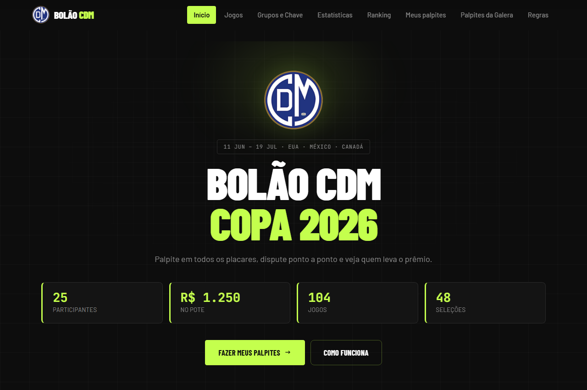
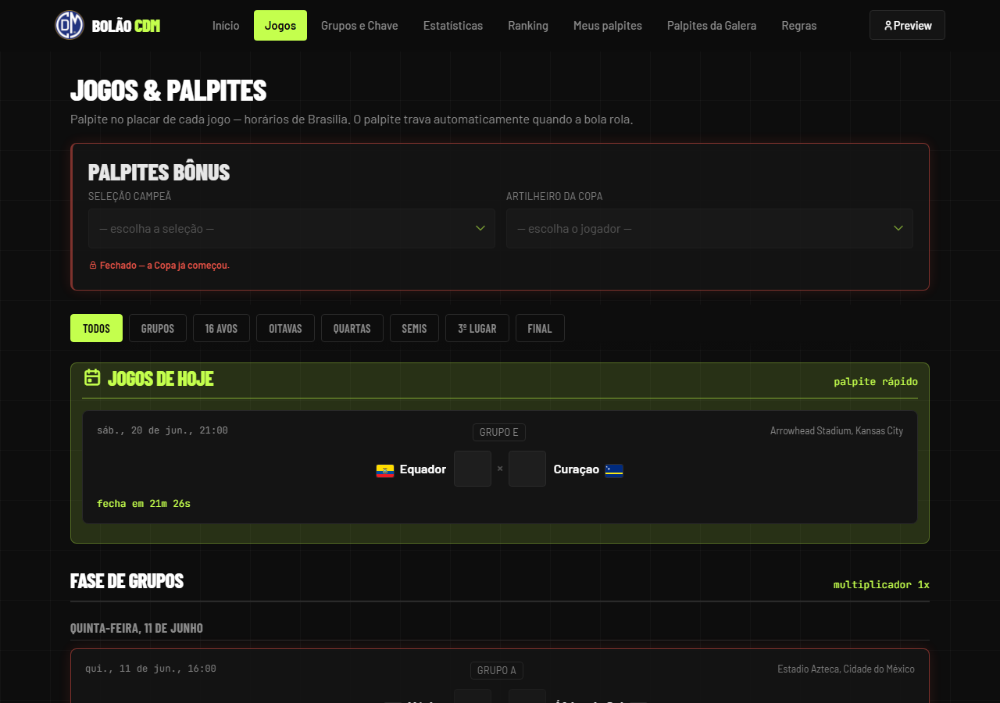
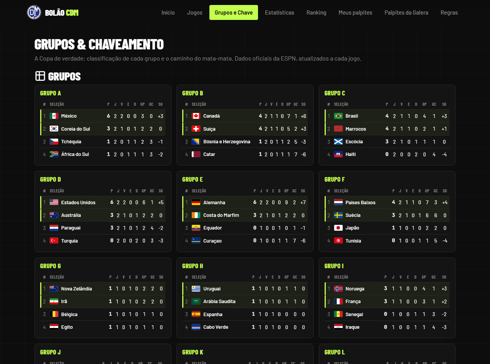
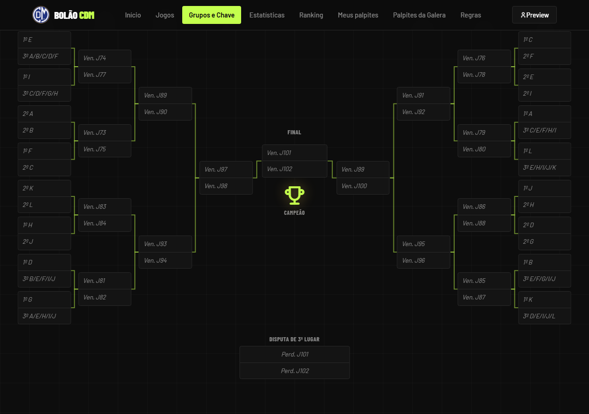
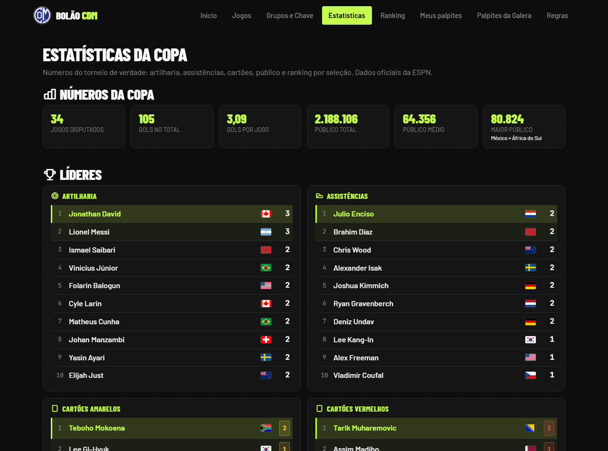
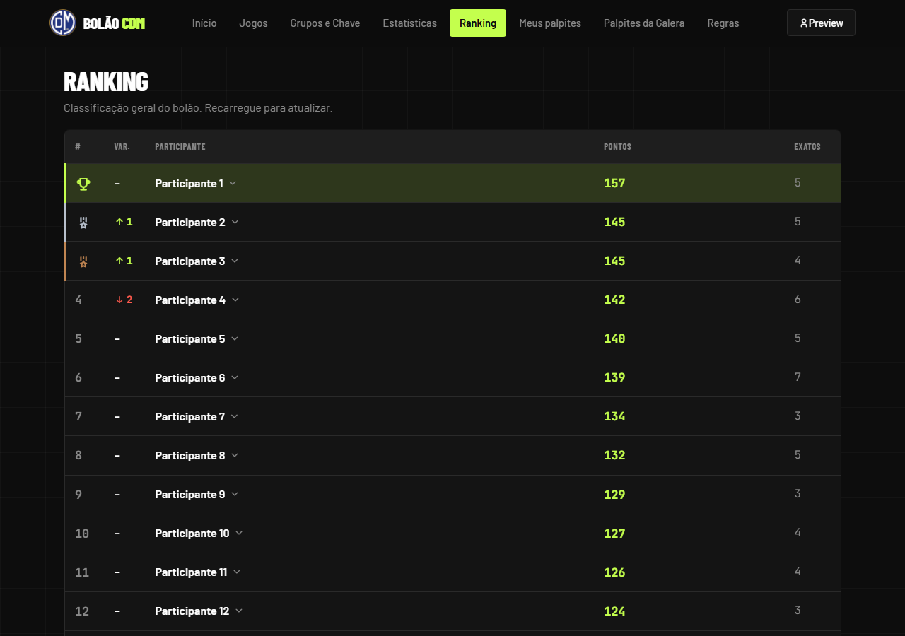
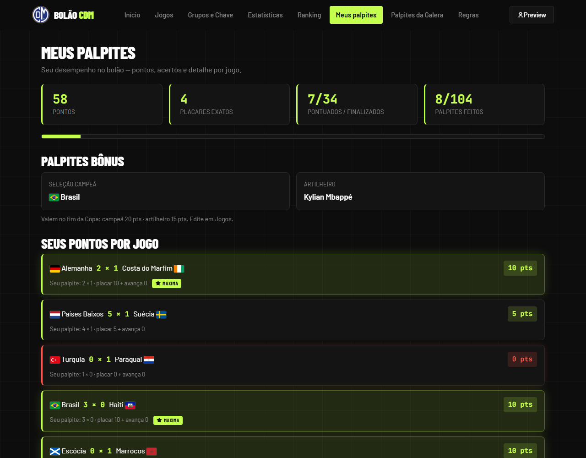
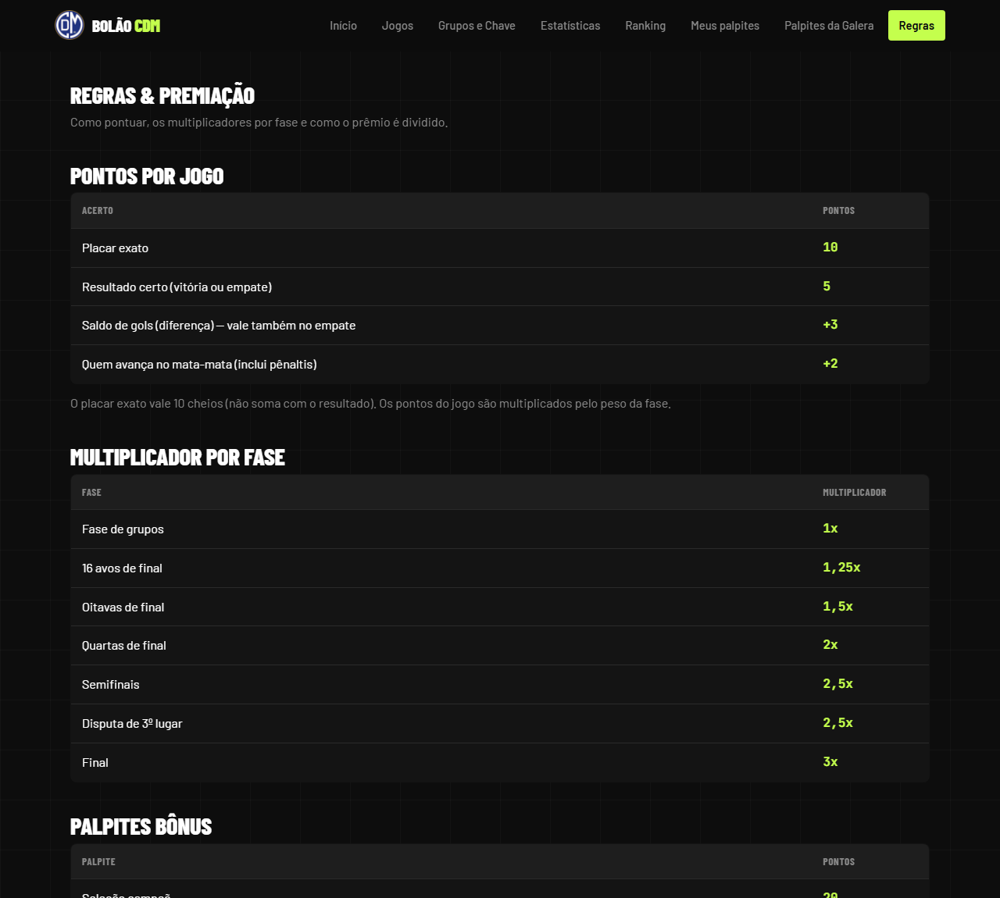
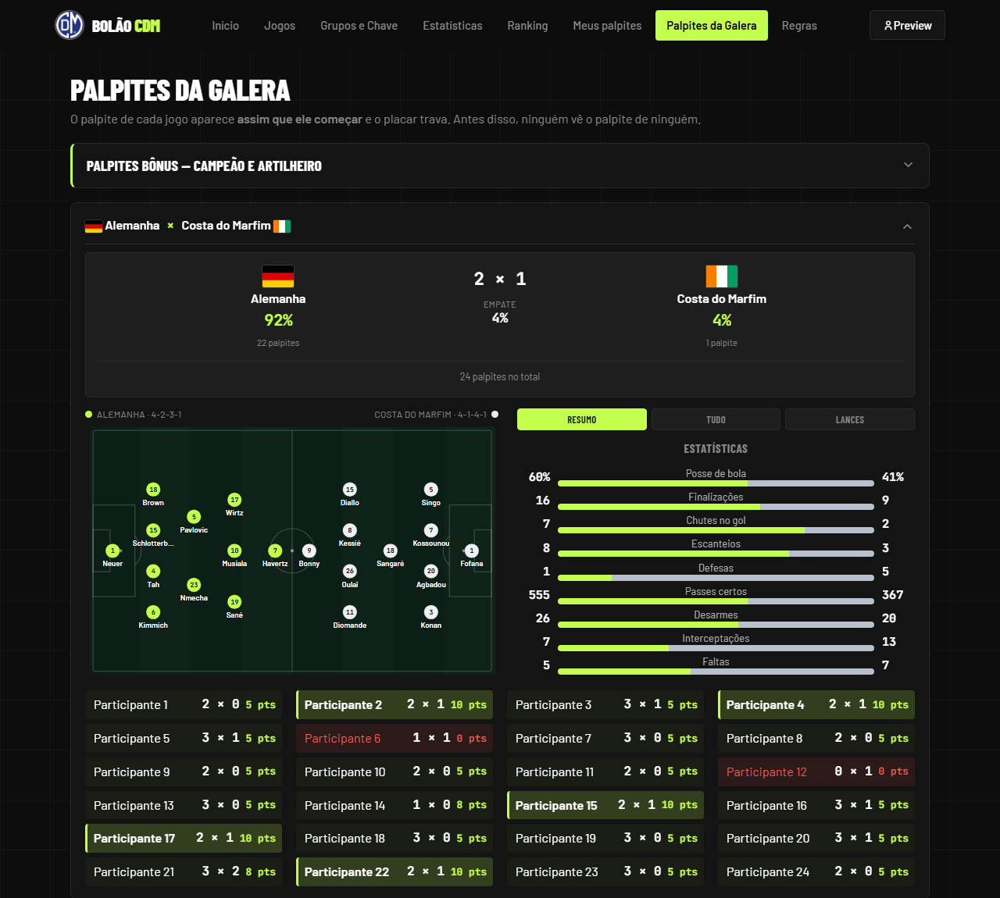

<div align="center">
  

  # Bolão CDM — Copa 2026

  **Plataforma web de bolão para a Copa do Mundo de 2026.**
  Palpites em todos os 104 jogos, motor de pontuação com multiplicadores por
  fase, palpites bônus e ranking compartilhado em tempo real.

  
  
  
  
  
</div>

---

## Sobre o projeto

Site para um grupo de amigos disputar palpites durante a Copa de 2026. Cada
participante cadastra um nome e um código pessoal, palpita os placares e os
bônus (seleção campeã e artilheiro), e acompanha sua pontuação e a classificação
geral. Os resultados reais são buscados **automaticamente** de uma API
esportiva, sem ninguém precisar digitar placar.

O desafio técnico interessante foi entregar um app com ranking compartilhado e
automação **sem servidor próprio e sem build** — só front-end estático mais um
backend gerenciado (Supabase) e uma função serverless agendada.

## Demonstração

| Home | Jogos & palpites |
| --- | --- |
|  |  |
| **Grupos** (classificação real) | **Chaveamento** (mata-mata) |
|  |  |
| **Estatísticas da Copa** | **Ranking** |
|  |  |
| **Meus palpites** | **Regras & premiação** |
|  |  |

Palpites de todos por jogo — revelados só depois que a bola rola — com a escalação
e as estatísticas ao vivo no mesmo card:



> _Os nomes no Ranking e nos Palpites da Galera foram **anonimizados** ("Participante N")
> nas imagens para preservar a privacidade do grupo._

## Funcionalidades

- **104 jogos** organizados por fase e grupo, com horários sempre em **Brasília**.
- **Motor de pontuação** em camadas: placar exato (10), resultado certo (5),
  saldo de gols (+3), classificação no mata-mata (+2), tudo multiplicado pelo
  peso da fase (grupos 1× → final 3×).
- **Palpites bônus**: seleção campeã (20 pts) e artilheiro (15 pts), com lista de
  todos os ~1.249 convocados agrupados por país.
- **Atalho "jogos de hoje"** no topo, espelhado com a lista cronológica (mesmo
  palpite, sem contar em dobro).
- **Trava automática** quando a bola rola: contador regressivo por jogo e
  fechamento ao vivo, sem depender de recarregar a página.
- **Palpites da galera**: depois que cada jogo começa, mostra o palpite de todos,
  com a divisão dos palpites e destaque de quem cravou.
- **Escalações + estatísticas ao vivo** (mapa do campo, cartões, lances e as 28
  estatísticas da partida), buscadas direto da ESPN no navegador e atualizadas
  durante o jogo. Jogos em andamento recebem um selo **"Ao vivo"** (também nos
  cards de Jogos e na aba da Galera).
- **Grupos & Chaveamento** (página nova): a **classificação real** dos 12 grupos
  e o **chaveamento do mata-mata** em chave de dois lados convergindo para a
  final (com o troféu no centro e linhas conectando os confrontos), tudo lido da
  API pública da ESPN.
- **Estatísticas da Copa** (página nova): artilharia, assistências, cartões
  (amarelos/vermelhos), maiores goleadas, público (total, médio e recorde) e um
  **ranking por seleção** — também da ESPN.
- **Ranking compartilhado** com critério de desempate (placares exatos →
  resultados certos) e setas de variação de posição. Clicar em **qualquer lugar
  da linha** expande o gráfico de evolução da posição e a lista de palpites nos
  jogos finalizados.
- **Mata-mata com times reais**: quando os grupos terminam, os confrontos
  ("1º A", "Ven. J##") viram os times de verdade nas telas de palpite (via ESPN).
- **Quem avança segue o placar**: no mata-mata, havendo vencedor no palpite ele
  avança automaticamente; a escolha manual de "quem avança" só aparece no empate.
- **Busca automática de resultados** via função serverless agendada (lê da ESPN);
  no mata-mata, o placar que vale é o do **tempo regulamentar (90')**.
- Identidade visual **"Neon Noir"** (tema escuro) e layout **responsivo** (mobile-first).
- Funciona **offline / com duplo-clique** (dados em arquivos `.js`, sem build).

## Stack

| Camada | Tecnologia |
| --- | --- |
| Front-end | HTML, CSS e JavaScript puro (sem framework, sem bundler) |
| Persistência local | `localStorage` |
| Backend | Supabase (PostgreSQL + PostgREST), consumido via `fetch` |
| Automação (resultados) | Supabase Edge Function (Deno) + cron, lendo da API pública da ESPN |
| Escalações, stats da partida, classificação dos grupos, chaveamento e estatísticas da Copa | API pública da ESPN (sem chave) |
| Convocados (lista do artilheiro) | football-data.org |
| Hospedagem | Netlify |

## Arquitetura

O projeto é organizado em **camadas com dependência unidirecional** — a interface
nunca fala direto com `localStorage` ou com o banco; passa por uma camada de
persistência (`storage.js`) e um adaptador de backend (`db.js`). A regra de
negócio vive isolada em um motor de funções puras (`scoring.js`), reaproveitado
no dashboard, no ranking e nos testes.

> **A explicação completa — com fluxogramas, diagrama de dados e detalhamento do
> código módulo a módulo — está em [`DOCUMENTACAO.md`](DOCUMENTACAO.md).**

```
index · jogos · galera · ranking · participante · grupos · estatisticas · regras  (páginas)
        └─ UI por página ─ scoring.js (regras) ─ storage.js ─ db.js ─ Supabase
                         ├─ data/*.js (jogos, seleções, convocados, resultados, espn-teams)
                         ├─ lineup.js ─ API pública da ESPN (escalações/stats/ao vivo)
                         └─ grupos.js · estatisticas.js ─ ESPN (classificação, chave, estatísticas)
```

## Como rodar localmente

```bash
# Opção 1 — testar sozinho: abrir index.html com duplo-clique.

# Opção 2 — servidor local (recomendado para testar o backend):
python -m http.server 5577
# acessar http://localhost:5577
```

Os testes do motor de pontuação ficam em `tests/scoring.test.html` (basta abrir
no navegador).

## Estrutura do repositório

```
├── index.html, jogos.html, galera.html, ranking.html, participante.html,
│   grupos.html, estatisticas.html, regras.html
├── assets/
│   ├── css/      estilos (global + um por página: jogos, galera, ranking, lineup,
│   │             participante, grupos, estatisticas)
│   ├── js/       lógica (scoring, storage, db, app, jogos, galera, ranking,
│   │             lineup, grupos, estatisticas, ko-teams, countdown, anim)
│   └── img/      logo
├── data/         matches.js, teams.js, scorers.js, results.js, espn-teams.js
├── supabase/     Edge Function de busca automática de resultados
├── docs/         guia de configuração do backend + screenshots
├── tests/        testes do motor de pontuação + simulação da fase de grupos
└── DOCUMENTACAO.md   documentação técnica completa
```

## Decisões técnicas (destaques)

- **Sem framework/build de propósito** — o escopo não justifica a complexidade
  (KISS/YAGNI); o site roda direto do arquivo.
- **Dados em `.js` e não `.json`** — permite carregar via `<script>` mesmo em
  `file://`, sem servidor.
- **`localStorage` + Supabase** — resposta instantânea local e ranking
  compartilhado, com sincronização em segundo plano que não trava a interface.
- **Motor de pontuação como funções puras** — testável e reutilizável.
- **Escalações e estatísticas direto da ESPN no cliente** — a API manda CORS
  liberado, então o campo e as stats ao vivo funcionam sem backend novo nem
  gravar nada no banco.
- **Placar do mata-mata vale os 90'** — prorrogação e pênaltis não contam como
  gol; pênaltis só decidem quem avança. A automação tira o placar regulamentar do
  `summary` da ESPN (1º + 2º tempo).
- **Avanço derivado do placar** — quem avança segue o vencedor do palpite; a
  escolha manual só no empate. Uma fonte única (`effectiveAdvance`) garante que
  placar e avanço nunca se contradigam, na tela e na pontuação.
- **Código documentado em JSDoc bilíngue (PT-BR/EN)** — docstrings em todas as
  funções e cabeçalho assinado em cada arquivo.

## Autor

Feito por **Bruno Krieger**.
Sinta-se à vontade para abrir issues ou usar como referência.
